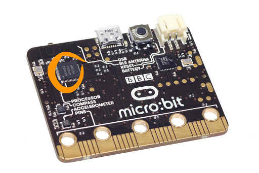

micro:bit Thermometer
--------------------
In this assignment you will program your micro:bit using the built-in temperature sensor. Here is a simple program that displays the current temperature in Celsius when the A button is pressed:
```python
from microbit import *

while True:
    if button_a.was_pressed():
        display.scroll(temperature())
```
The temperature sensor measures the temperature of the processor chip that can be found on the left hand side of the back of the micro:bit. The processor is circled in the picture below:      
   
Try holding your finger on the processor and see if you can increase the temperature sensor reading.

Program requirements
-----------------
* Your program must use at least two variables to store the maximum and minimum temperatures
* Your program must display either Celsius or Fahrenheit temperatures depending on which button was pressed
* Here's a sample video showing the current, maximum and minimum Fahrenheit temperatures when the B button is pressed:   
   
* Every temperature displayed on the LED should be correctly labled as Celsius or Fahrenheit (abbreviating °C and °F is fine)
* Submit both the Python code and an animated gif showing your program running to Google Classroom

Suggested steps to completing this assignment
----------
1. You may find slides 87-93 of the of the [slide presentation](https://docs.google.com/presentation/d/1aiGcnPn8uoCJdX8p7_qoI3Hh3_KOhUtFeB3Byw0tacA/edit?usp=sharing) helpful in completing this assignment.
2. Using the program above as a guide, add code that displays the current temperature in Fahrenheit if the B button is pressed. You can do a google search to find the formula to convert Celisus to Fahrenheit
3. Add variables to store the current maximum and minimum temperatures
4. Modify the program to check the temperature every second. If the thermometer reads a temperature higher or lower than the previous maximum or minimum, update the appropriate variable
5. Modify the display to scroll 3 temperatures; current, maximum and minimum. The A button should display all three temperatures in Celsius and the B button should display the same temperatures converted to Fahrenheit. 

A technical note on the Degree Symbol °
-----------------
The degree symbol ° is not supported on the LED display of the micro:bit. The micro:bit LED display only supports ASCII characters 32 - 127 and the degree symbol ° is ASCII code 248. The asterix * or apostrophe ' are reasonable substitutes. 

Extensions
----------
You could modify your program to display a graph showing the relative current, maximum and minimum when neither button is pressed.

**Are you hot?** Modify your program so that it tells a person how hot they are when they hold their finger on the processor. Pass your micro:bit to your friends and see which one is hottest.

Your thermometer program doesn't have to work or look like any other. Have fun and be creative!

Samples of Student Work
----------
[Tennyson](TennysonThermometer.gif)   
[McKayla](McKaylaThermometer.gif)   
[Renzl](RenzlThermometer.gif)   
[Sandy](SandyThermometer.gif)   
[Ally](AllyThermometer.GIF)   
[Emerson](EmersonThermometer.gif)   
